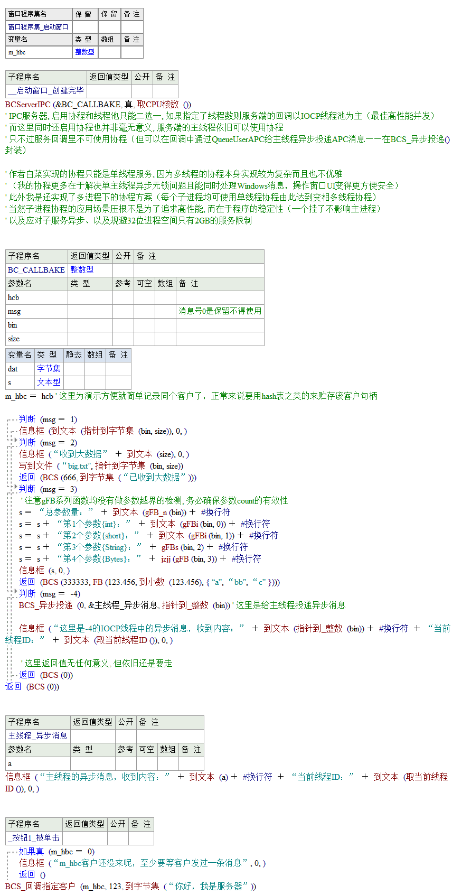
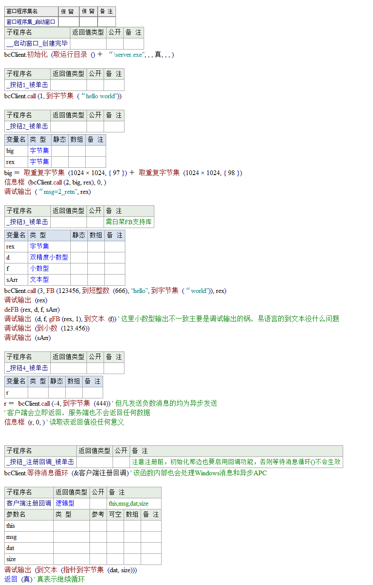

## 白菜通信过程调用框架

### 简介

仓库包含三个主要项目及其下属的各子项目

- 易语言实现的协程本体（基于Win32Fiber）与协程扩展（文件读写、TCP客户端）
- IPC（进程间通信，基于Win32API邮槽和共享内存实现，可采用APC/协程模型或IOCP/多线程模型）
- RPC（远程过程调用，易的实现模型同上，但关键在于跨语言能力，目前实现或已部分实现的语言有E、PHP、JS、Python）

### 序言·协程的五层境界

第一层：知道一个语言有所谓的执行流程让出机制，如轻量状态切换的yield跟生成器对象

第二层：结合异步IO的含事件消息循环的切换async/await，会用其封装的协程方法

第三层：基于底层封装提供的运行时协程API进行异步框架设计

第四层：理解操作系统线程的核心知识，运行时协程本体的重新设计或再优化（减少模拟栈或完整上下文的行为，并加上内存池、协程池或共享栈进一步减少开销和提升性能）

第五层：状态机协程（由编译器在全局统筹而产生协程切换的高性能编译期代码，但也不一定是全程无栈协程）

### 一、易·协程篇（我在第三层）

#### 前言

首先我必须得声明：我的协程实现基于Win32Fiber且用完即销毁（Fiber内存开销上硬性要求最低64KB保留栈（即Fiber最高上限在3w左右）和至少4KB提交栈，快是不可能有多快的，但我想比的压根不是开销跟性能）

我是知道这类运行时协程，后续可以通过内存池等手段来优化附加数据 亦或干脆直接将申请内存的地方放在Fiber实现的保留栈上（即做共享栈、搞Fiber池，而不是用完就销毁再新建）

甚至通过理解系统底层线程切换机制后自己另起炉灶从0开始实现更细致的运行时协程, 但这些实现起来肯定都很不优雅（由于涉及线程寄存器等上下文切换，纯易自身去写是不可能的，要么扣汇编要么封装DLL）

`（后面我还会考察C++20的协程——相信在C++那边会得到最优解, 编译器层级的状态机协程, `

`而想扣汇编的话在编译期是不可能做到的、省去在易干脏活累活的事情了，`

`不过到时我也已经让易正式退出我的历史了）`

**在易这边属于最小化实现，代码逻辑清晰，真的不想写成屎山**

此外我的目的仅是告诉易友们尽管非高性能下的协程它依然有存在的价值，以及让更多人知道基于协程API后的框架设计封装协程应用的原理。

1. 单线程异步并发下可以写出整洁的同步化代码
2. 单线程相比多线程天然无锁读写无冲突的优势，非常适合UI操作
3. 协程扩展接口规范，怎样编写的很优雅方便扩展易的协程生态

协程源码里我内置了10000个4字节整型数组来静态存储各个hFbier，这意味着我对易协程的支持只能最大提交10000个任务（同时因Fiber开支要求会占用至少625 MB 的虚拟地址），但可后续通过等待机制阻止协程进一步提交创建新任务，即单线程中每隔100ms去轮询只有等可用的协程退出时才接着继续回到创建点继续创建协程（这部分看源码可知该妥协方案的妙处，【基础协程/! 协程压力测试.e】可测试超过1w的协程任务创建正确执行，当然这个方案也并非完美这个你可以仔细思考还会有什么不足）

#### 等待对象信号(这里演示等待创建的进程退出)

#### 三种方式的等待协程执行完毕

由于代码较多这里就不贴了（可详情源码"三种方式的等待协程执行完毕.e"），这里就简单聊聊

方法一：手动变量计数，手动切换协程

方法二：采用协程通道类（虽然也可以实现但并非协程通道的最佳应用场景）

方法三：自己封装变量计数（同时也将切换细节进行封装，推荐！）

#### 探讨协程通道的真实使用场景

首先我的协程里实现的协程通道有两种模型（LIFO和FIFO，在无数据时 协程级阻塞，push是多生产者，但pop这里实现上局限于一个协程消费者）
其实对于模拟栈而言比模拟队列的意义更大（响应最新事件、覆盖型任务）
比如一种应用场景：适合仪表盘这种实时刷新数据的，现在有好几条数据一块到来了，那么以最后的数据显示为主（其余的可保留作为日志参考或直接丢弃）

而协程里纯队列FIFO（由于我这里实现的协程通常是单线程），那么这种FIFO我认为就没有太大的应用价值
原因是，能用上协程的地方多半是用上异步IO事件的，其给出的响应本身就是串行顺序处理，又或者数据还保留在内核的后续只不过需要赶上时才被接着消费（当然你说是为了快点从内核中摘除数据释放内核缓冲区，其实也不对，因为异步IO每次提交都是会创建分配新的用户内存空间且之后才给到协程上，所以这部分早就脱离内核缓冲区了——当然这部分是可以还再优化为使用先进的内存池管理了）
而这里FIFO本质就也只是普通顺序处理并没有重新做决策（还多了一层毫无必要的搬运）
故协程通道的队列版想要变得有价值，务必实现优先级队列才行（只有“可排序 / 可抢占”的事件队列才有价值）
这里我只是提一个idea，我自己是实际项目并还没用上这部分功能（而且优先级队列实现上也比传统的数据结构较为复杂，通常是完全二叉树实现的MinHeap）

#### 子进程池下的协程服务（付费内容）

- 在各子进程中支持协程复用
- 一个子进程崩溃可自动重启不影响主进程
- 规避易的单个32位进程仅有2GB用户空间的限制

使用示例在【协程本体与协程生态/基础协程/4.子进程池版协程.e】

### 二、IPC篇

#### 前言的一些问题探讨与设计理念

**[1.进程间通信遇到什么问题]**
如果进程间通信是完全一对一的（指一个服务器端对应一个单线程客户），并且该单线程的客户不采用任何异步手段进行并发（即每次访问必定等待服务端的响应后才再次访问）那么进程间通信只需两端维护一个共享内存即可（当然该共享内存在设计上可以根据预定好缓冲大小，如果超过该大小则再次采用额外创建共享内存然后用完就释放它）

但如果该单线程客户允许使用异步并发（或是多进程客户或单进程内的多线程客户），也就是一时间的消息到来对于服务器而言没办法维护一个共享内存了，那么此时服务器端就要采用进程级的消息队列的形式（这样即便是多个客户同时往一个服务进程去塞进消息也不会覆盖多个消息本身），然后服务端根据其消息队列本身还可以采用多线程方式去进行“并发式消费”则可同时处理消息并返回处理结果到多个客户，从而进一步提高处理性能！

**[2.如何实现进程级消息队列]**
尽管有Windows自带的消息队列(Get/SendMessage)但这玩意通常是为窗口UI服务的会受到总消息数和性能的制约；

如果只是进程内的线程间通信可以采用性能最好的APC异步过程调用来实现，但QueueUserAPC并不能跨进程去投递APC队列，因为它所给的回调函数本身就只能在本进程内去访问其自身的地址空间（故只投递消息的话可能本身没什么问题但传递大数据或引用到非本进程的地址就完全不可行了），并且不同位数(32位<->64位)的程序去发起因为它的回调函数代码本身更加不能兼容跨进程的处理（微软官方也指出跨进程APC会存在问题）

如果使用最基本的事件/信号量+固定size的共享内存去搞消息队列，尽管可行，但也不容易向其中发出大量且体积较大的数据，再来是消息队列扩容本身也是个问题，因为CreateFileMapping一旦创建后该大小无法改变、并且也不容易销毁，因为只要有一方打开后内核对象的引用计数就不会是0，只有全都closehandle时才会销毁，故只能再额外创建新共享内存并用链表串起来——但还是那句话维护起来真的很麻烦，像是要手动写共享内存版的内存池管理一样。。

基于以上原因跨进程的消息队列本身不适宜自己手工实现，所以应当寻求系统自带的对于跨进程处理有什么好的内核级对象支持消息队列和传递大数据的通信方案！

**[3.邮槽/命名管道/套接字选哪个]—**套接字就不用说了性能肯定不如前两者
虽然我最终是使用了邮槽作为通信方案，但我还是要说说命名管道存在的问题

命名管道尽管支持双向通信(可客户到服务端然后服务端返回客户端数据)，且在使用的时候参数繁杂不说（提供支持流式和用户报文两种形式），关键是它并不能像TCP套接字那样即时连接即时支持多客户的多路句柄构建（这里边内幕挺深的，写过才知道用这玩意是真坑）

具体来讲，首先需求上应当支持多客户同时访问，那么命名管道本身的管道实例就肯定不能是一个，这句话的理解在于服务端一开始自身是一条管道，消息到来后就必须要为刚进来的客户那端去创建新的管道（这个在TCP套接字编程那边是支持这样做的），故：用多个管道的根本意义在于服务端输出返回值时不与其他客户冲突
尽管命名管道它也支持多个管道实例的连接创建但其实现是不完美的（ConnectNamedPipe用于等待新客户的到来但先前必须要创建好足够多的实例做准备，而不是客户每来一个就临时自动创建一个），此外将命名管道进行IOCP模型化时不容易区分是新到来的客户事件还是正在通信中的客户数据到来（虽然后来知道可以在重叠结构中给出自定义状态，对于新创建的实例投递ConnectNamedPipe后第一次IO完成响应时一定是新客户到来再次发出ReadFile投递后响应才是数据到来，通信完后务必要销毁掉该新实例，故总体而言在编码上还是挺麻烦的——但这不是关键，当你看我对下面分析邮槽IOCP模型化的设计优化你就知道我为什么更亲赖于使用邮槽了）；

使用邮槽的话它虽然仅支持单向通信且以用户报文形式进行传递，并且好处在于无差别客户发送数据进来不需要进行连接和等待连接，不过由于单向性故服务端并不能对其自身的同个邮槽发往到客户端，当然解决方案自然是客户端自己准备好它那边的邮槽就可以了那么这就不是什么问题了，然后客户投递给服务端数据时需额外提供客户这边自己的邮槽命名就可以让服务端打开后就可以发返回数据了！

**[4.邮槽的IOCP模型化与设计优化]**
首先在邮槽设计优化上客户这边如果自身对象不跨线程去调用则并不需要临时创建新邮槽，而是直接缓存该通信客户对象在初始化时所在主线程上的同个邮槽对象即可，以后就省去创建和销毁的开销（当然如果同个对象需要支持多线程则不可避免要临时创建和销毁新建的邮槽，可单独区分与初始化时所给的线程ID相对比即可知道当前对象的方法调用是否跨了线程，新建邮槽的意义在于多出一个独立使用的信道而不与原先的传输起冲突）

邮槽IOCP模型化后按理来说，服务端每条线程都维护各自独立的一个固定缓冲区来接收报文是最理想的（避免多次创建和销毁内存），但如果固定了缓冲区也带来一个问题就是要接的报文本身是多大的数据并不能直接知道，接的时候也不一定不会超出缓冲区大小，且最致命的是由于是无差别的客户报文你不可能再接着继续调用ReadFile读之后的数据（因为那可能不是你当前客户的数据，而是其他客户的），

对于邮槽IOCP模型化固定缓冲区的思路本身没问题，而对上述问题我还另外提出了采用共享内存的方式来给出额外参数，具体实现是这样的，首先固定邮槽的缓冲区64KB，如果超出64KB则额外采用共享内存映射的形式直达服务端的进程空间（该共享内存的内核对象名称是临时的，用完后当即销毁），那为何一开始不全都使用共享内存而是64KB？

之所以是64KB，我做个测试即便是映射了共享内存但它存在创建、映射、关闭、销毁该内核对象本身则存在一定的性能损耗，如果是少量数据本身可以一次性在邮槽/管道内携带（不必额外再给出共享内存），大数据的话传输上用上内存共享由于可以直接映射到对方的服务进程方的地址空间被处理时可以投递映射后的指针故是零复制性能非常高效，在64KB的时候创建和销毁共享内存的耗时几乎忽略不计（因为你就算用邮槽/管道传输了本身数据还会被服务端复制出来一份（在ReadFile时所给的缓冲区肯定是私有内存嘛），量越大时本身损耗会逼近创建/销毁共享内存这一内核对象且来的更快在超过64KB可以说是实验得出的临界点）

**[5.关于用户权限和Session隔离问题]（付费内容，你也可以尝试问AI自行解决）**

**[6. 异步单线程协程化处理]**
我在易语言这边已经实现了可扩展的协程框架，基于此允许开发者很容易开发出各式的协程生态（比如文件读写、套接字通信等但凡能够原生采用win32异步IO的调用，甚至还有一个通杀的wait信号量的协程化方案）

起初搞协程我是用于游戏脚本，需要每个多任务中死循环延时周期性检测而并行处理子任务，但又不想开多线程去实现（很容易造成资源冲突），由于传统sleep延时本身会阻塞上线程，那么我需要在延迟的同时还能去做其他事仍需保持其代码上下文的同步性故此需协程化，后来把它慢慢扩展到了在客户端/服务端上应用的完整的协程生态！（包括IPC和RPC都通用，甚至还有多子进程模式下的协程版本）

**[7. 可变参数及通用数据类型的统一封装格式]** 
变参由语言本身去实现不必多说，问题在于如何把这些参数高效打包为字节集在通信中的载体，以及不必全解析而随时可访问任意其中的索引参数

> 参考我的另一个项目：https://github.com/xbcsoft/BC-FB-Standard

#### 服务端示例代码（易语言）

#### 客户端示例代码（易语言）

#### IPC的单例服务模式

具体示例参考：IPC\单例服务模式

### 三、RPC篇

主要是讲解通信模型和协议规范，由于篇幅较长移步至（可能还未更新完）

> https://wiki.xbcsoft.com/BC-RPC

